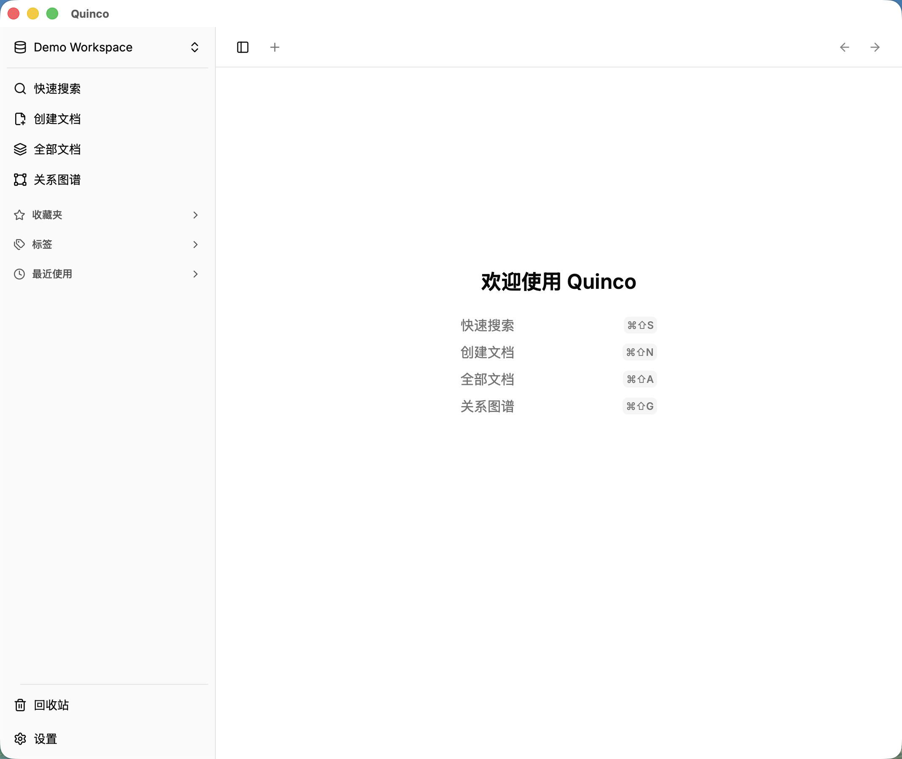

  
  <h1>Quinco</h1>
  
<a href="./CHANGELOG.md">更新日志</a> | <a href="./README_EN.md">English</a>

  

  

## ✨ 项目简介

Quinco 是一个基于 [Tauri2](https://tauri.app/) 和 [ReactJS](https://react.dev/) 构建的双链编辑器。

## 📷 截图

  

## 📺 支持平台

- darwin-aarch64

> macOS 用户下载新版后如遇"无法验证开发者"提示，请前往 系统设置 → 隐私与安全性 点击仍要打开。

## 🤝 贡献

欢迎提交 issue 或 PR，参与项目共建！(<a href="./.github/docs/CONTRIBUTING.md">贡献指南</a>)

## 🔗 感谢

- [BlockNote](https://github.com/TypeCellOS/BlockNote)
- [Magic UI](https://github.com/magicuidesign/magicui)
- [Shadcn UI](https://github.com/shadcn-ui/ui)
