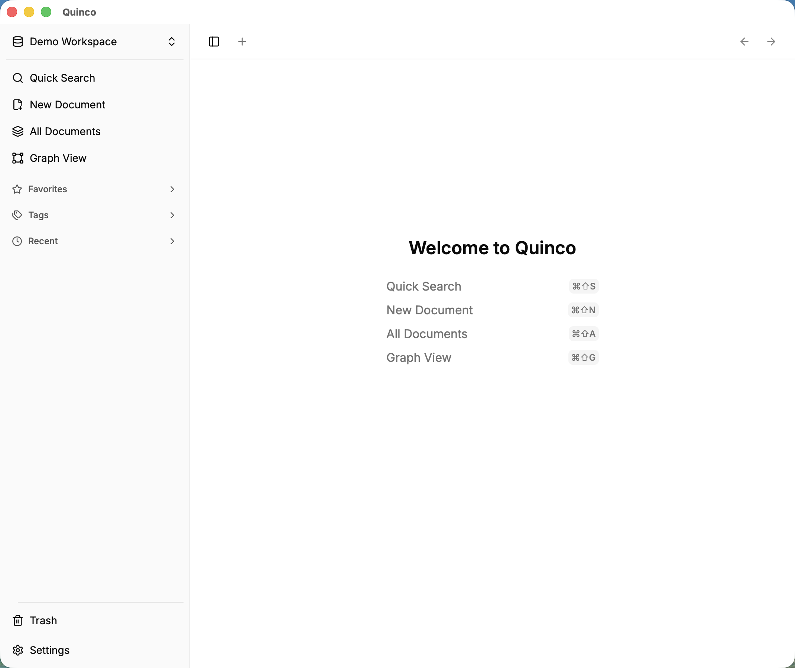

  
  <h1>Quinco</h1>
  
<a href="./CHANGELOG.md">CHANGELOG</a> | <a href="./README.md">中文简体</a>

  

  

## ✨ Introduction

Quinco is a bidirectional link editor built with [Tauri2](https://tauri.app/) and [ReactJS](https://react.dev/).

## 📷 Screenshots

  

## 📺 Supported Platforms

- darwin-aarch64 (Apple Silicon Macs)

> macOS users: If you see "cannot verify developer" after downloading a new release, go to System Settings → Privacy & Security click Open Anyway.

## 🤝 Contributing

Issues and pull requests are welcome! Join us in building this project together.(<a href="./.github/docs/CONTRIBUTING_EN.md">Contributing Guide</a>)

## 🔗 Acknowledgments

- [BlockNote](https://github.com/TypeCellOS/BlockNote)
- [Magic UI](https://github.com/magicuidesign/magicui)
- [Shadcn UI](https://github.com/shadcn-ui/ui)
